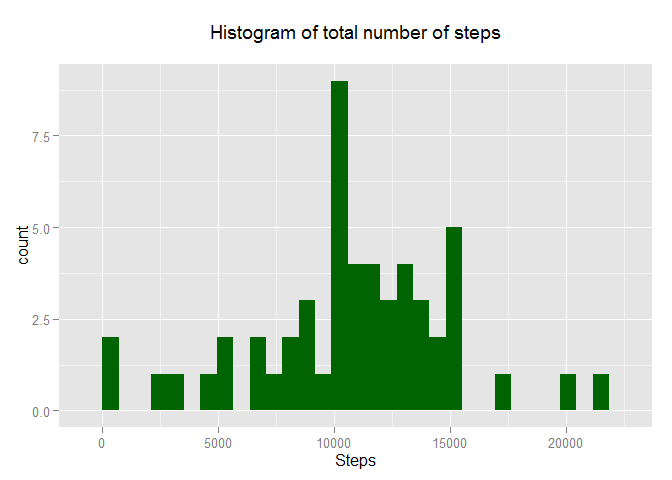
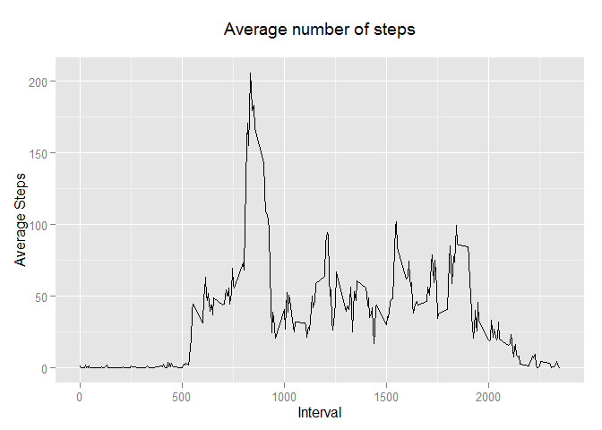
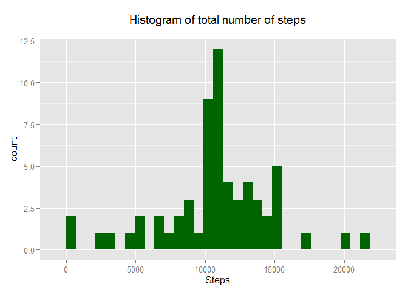
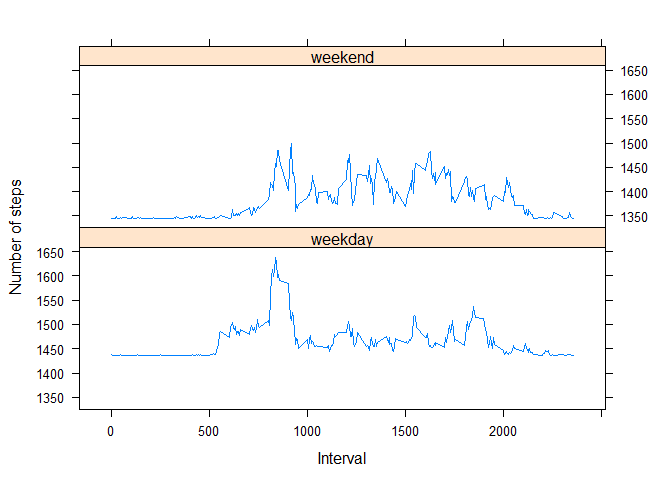

# Reproducible Research: Peer Assessment 1


## Loading and preprocessing the data

I use the packages dplyr, lubridate and ggplot2 and also lattice.I only use the lattice packages for last exercise.


```
## Loading required package: dplyr
## 
## Attaching package: 'dplyr'
## 
## The following objects are masked from 'package:stats':
## 
##     filter, lag
## 
## The following objects are masked from 'package:base':
## 
##     intersect, setdiff, setequal, union
## 
## Loading required package: lubridate
## Loading required package: ggplot2
```
Loading the file is done with:


```r
activity<-read.csv("./activity.csv",sep=",",dec=".",header = TRUE)
date<-ymd(activity$date)
activity<-as.data.frame(activity)
```

I use mutate do make new day variable with wday function from lubridate.

```r
act<-mutate(activity,day=wday(date,label=FALSE))
```
## What is mean total number of steps taken per day?

The number of steps taken per day is: 

```r
tot<-aggregate(steps~day,act,sum)
print(tot,type="html")
```

```
##   day steps
## 1   1 85944
## 2   2 69824
## 3   3 80546
## 4   4 94326
## 5   5 65702
## 6   6 86518
## 7   7 87748
```
And the total is: 

```r
sum(tot, na.rm=TRUE)
```

```
## [1] 570636
```

I use the ggplot function to make the histogram of the total number of steps taken each day is: 

```r
h<-aggregate(steps~date,act,sum)

step_hist<-ggplot(h,aes(steps))
step_hist+geom_histogram(fill="darkgreen")+xlab("Steps")+labs(title="Histogram of total number of steps\n")
```

```
## stat_bin: binwidth defaulted to range/30. Use 'binwidth = x' to adjust this.
```

 

The mean and median of the total number of steps taken per day is:


```r
mean(h$steps,na.rm=TRUE)
```

```
## [1] 10766.19
```

```r
median(h$steps,na.rm=TRUE)
```

```
## [1] 10765
```


## What is the average daily activity pattern?


The time series plot of the 5-minute interval (x-axis) and the average number of steps taken, averaged across all days (y-axis)

```r
avg_steps<-aggregate(steps~interval,act,mean)
time_avg<-ggplot(avg_steps, aes(interval,steps))
time_avg+geom_line()+labs(title="Average number of steps\n")+labs(x="Interval")+labs(y="Average Steps")
```

 

Which 5-minutes interval, on average acorss all the days in the dataset, 
contains the maximum of steps:

```r
loc<-which.max(avg_steps$steps)
avg_steps[loc,1,]
```

```
## [1] 835
```
And the maximum average number of steps is: 

```r
avg_steps[loc,2,]
```

```
## [1] 206.1698
```


## Imputing missing values

The total number of missing values in the dataset is:


```r
v<-is.na(act$step)
sum(v)
```

```
## [1] 2304
```
You need to define a strategy. This example is where we take the average of the day in case of a NA. 

```r
meanday<-mean(h$steps,na.rm=TRUE)

act1<-mutate(activity,na_obs=ifelse((is.na(activity$steps)==TRUE),1,0))

y<-filter(act1,na_obs==1)
y$steps<-0
na_sum<-aggregate(steps~date,y,sum)
na_sum$steps<-meanday
x<-filter(act1,na_obs==0)
sum_x<-aggregate(steps~date,x,sum)
```

The new dataset with the imputed values is: 

```r
new_data<-rbind(na_sum,sum_x)
```

The histogram of the total number of steps taken each day: 

```r
step_hist<-ggplot(new_data,aes(steps))
step_hist+geom_histogram(fill="darkgreen")+xlab("Steps")+labs(title="Histogram of total number of steps\n")
```

```
## stat_bin: binwidth defaulted to range/30. Use 'binwidth = x' to adjust this.
```

 

The mean and median is: 


```r
mean(new_data$steps)
```

```
## [1] 10766.19
```

```r
median(new_data$steps)
```

```
## [1] 10766.19
```

The estimates differ from the first part. 


## Are there differences in activity patterns between weekdays and weekends?

Definition of a new variable. I use the mutate function. I have already made a variable day with use of the wday function (wday equals 1 on sunday and 7 on saturday).


```r
act_new<-mutate(act,weekday=(ifelse((day==1)|(day==7),"weekend","weekday")))
act_new$steps<-ifelse(is.na(act_new$steps)==TRUE,mean(new_data$steps)/288,act_new$steps)
```
first I find total number of steps for each interval and for each type of day (weekday/weekend):

```r
total_steps1<-aggregate(steps~interval+weekday,act_new,mean)
```
For making the timeseries plot I use the lattice plotning system:


```r
xyplot(steps~interval|weekday,type="l",data=total_steps1,layout=c(1,2),xlab="Interval", ylab="Number of steps")
```

 
